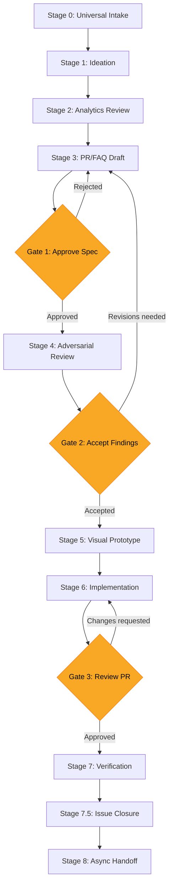
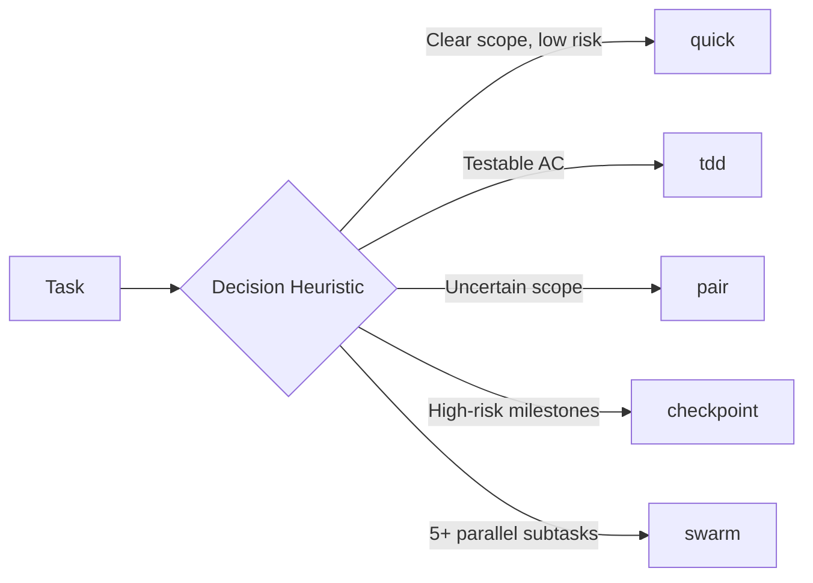

# Spec-Driven Development

A Claude Code plugin that drives software from spec to deployment with AI-agent-native ownership boundaries, adversarial review, and execution mode routing.

## What This Is

This plugin provides a complete methodology for spec-driven development with AI coding agents. It covers the full lifecycle: writing specs, reviewing them adversarially, decomposing into tasks, implementing with the right execution strategy, and closing issues with evidence.

**Complements [Anthropic's product-management plugin](https://github.com/anthropics/knowledge-work-plugins/tree/main/product-management):** That plugin helps PMs *write* specs (roadmaps, stakeholder updates, PRDs). This plugin drives specs *through review, implementation, and closure* -- the orchestration layer between "spec approved" and "feature shipped."

## What Makes This Different

1. **Agent ownership model** -- Clear rules for when the AI agent closes issues vs. proposes closure vs. defers to the human. No more guessing about agent autonomy boundaries.
2. **Adversarial review architecture** -- 4 concrete options (from free CI agents to Opus API pipelines) with ready-to-use GitHub Actions workflows.
3. **Execution mode routing** -- Tasks are tagged with one of 5 modes (quick/tdd/pair/checkpoint/swarm) that determine ceremony level, review cadence, and agent autonomy.
4. **Working Backwards PR/FAQ** -- Amazon-style templates with built-in adversarial prompts (pre-mortem, inversion analysis) and research grounding requirements.

## Installation

### From Claude Code

```bash
# Add as a plugin
claude plugins add /path/to/spec-driven-development

# Or symlink to your skills directory
ln -s /path/to/spec-driven-development ~/.claude/skills/spec-driven-development
```

### Manual

Clone the repo and symlink it into your Claude Code skills directory:

```bash
git clone https://github.com/cianosullivan/spec-driven-development.git
ln -s "$(pwd)/spec-driven-development" ~/.claude/skills/spec-driven-development
```

## The Funnel

Every feature, fix, and infrastructure change flows through a 9-stage funnel with 3 human approval gates.



| Stage | What Happens | Gate |
|-------|-------------|------|
| 0. Universal Intake | Normalize ideas from any source into project tracker | -- |
| 1. Ideation | Explore problem space, gather context | -- |
| 2. Analytics Review | Data-informed prioritization | -- |
| 3. PR/FAQ Draft | Write Working Backwards spec | Gate 1: Human approves spec |
| 4. Adversarial Review | 3-perspective stress test | Gate 2: Human accepts findings |
| 5. Visual Prototype | UI/UX mockups if applicable | -- |
| 6. Implementation | Code with execution mode routing | Gate 3: Human reviews PR |
| 7. Verification | Deploy, test, validate | -- |
| 7.5. Issue Closure | Evidence-based closure protocol | -- |
| 8. Async Handoff | Session summary for continuity | -- |

## Commands

Commands are user-invoked workflows triggered with `/sdd:<command>`.

| Command | Description |
|---------|-------------|
| `/sdd:write-prfaq` | Interactive PR/FAQ drafting with template selection |
| `/sdd:review` | Trigger adversarial spec review (Options A-D) |
| `/sdd:decompose` | Break an epic/spec into atomic implementation tasks |
| `/sdd:start` | Begin implementation with automatic execution mode routing |
| `/sdd:close` | Evaluate closure conditions and close with evidence |
| `/sdd:hygiene` | Audit open issues for label consistency and staleness |

## Skills

Skills are passive knowledge that Claude surfaces automatically when relevant context appears in conversation.

| Skill | Triggers On | What It Provides |
|-------|------------|-----------------|
| `spec-workflow` | Funnel stages, workflow planning | 9-stage funnel with gate definitions |
| `execution-modes` | Task implementation, mode selection | 5-mode taxonomy with decision heuristics |
| `issue-lifecycle` | Issue closure, status transitions | Agent/human ownership table, closure rules |
| `adversarial-review` | Spec review, quality assurance | 3 perspectives, 4 architecture options |
| `prfaq-methodology` | Spec writing, Working Backwards | 4 templates with research grounding |
| `context-management` | Session planning, delegation | Subagent tiers, context budget rules |

## Execution Modes



| Mode | When | Agent Autonomy | Ceremony |
|------|------|---------------|----------|
| `quick` | Small, well-understood changes | High | Minimal |
| `tdd` | Testable acceptance criteria | High | Red-green-refactor |
| `pair` | Uncertain scope, needs exploration | Low (human-in-loop) | Interactive |
| `checkpoint` | High-risk, milestone-gated | Medium | Pause at gates |
| `swarm` | 5+ independent parallel subtasks | High | Subagent orchestration |

## Adversarial Review Options

| Option | Cost | Automation | Model Quality | Setup |
|--------|------|-----------|---------------|-------|
| A: CI Agent | $0 | Full | Good | Low |
| B: Premium Agent | ~$40/mo | Full | Very Good | Low |
| C: API + Actions | ~$2-8/review | Full | Best (configurable) | Medium |
| D: In-Session | $0 | Manual | Very Good | None |

GitHub Actions workflows for Options A and C are included in `skills/adversarial-review/references/`.

## Issue Closure Rules

The agent follows strict rules about when it can close issues:

| Condition | Action |
|-----------|--------|
| Agent assignee + single PR + merged + deploy green | Auto-close with evidence |
| Multi-PR, research issues, complex scope | Propose closure, await confirmation |
| Human-assigned or `needs:human-decision` | Never auto-close |

## Customization

This plugin uses `~~placeholder~~` conventions for organization-specific values. Replace these with your own:

| Placeholder | Replace With | Example |
|-------------|-------------|---------|
| `~~team-name~~` | Your team/org name | `Acme Engineering` |
| `~~PREFIX-XXX~~` | Your issue prefix | `ACME-042` |
| `~~owner/~~repo~~` | Your GitHub org/repo | `acme/product` |
| `~~project-tracker~~` | Your tracker tool | `Linear`, `Jira`, `Asana` |
| `~~version-control~~` | Your VCS platform | `GitHub`, `GitLab` |
| `~~ci-cd~~` | Your CI/CD platform | `GitHub Actions`, `CircleCI` |
| `~~analytics~~` | Your analytics tool | `PostHog`, `Amplitude` |
| `~~deployment~~` | Your deploy platform | `Vercel`, `AWS`, `Railway` |

## Connectors

The plugin works best with these connected services (see [CONNECTORS.md](CONNECTORS.md) for details):

**Required:** Project tracker (Linear, Jira, Asana) + Version control (GitHub, GitLab)

**Recommended:** CI/CD, Deployment platform, Analytics

## Project Structure

```
spec-driven-development/
├── .claude-plugin/
│   └── plugin.json              # Plugin manifest
├── .mcp.json                    # Connector configuration
├── commands/
│   ├── write-prfaq.md           # Interactive PR/FAQ drafting
│   ├── review.md                # Adversarial spec review
│   ├── decompose.md             # Epic → atomic task breakdown
│   ├── start.md                 # Implementation with mode routing
│   ├── close.md                 # Evidence-based issue closure
│   └── hygiene.md               # Issue health audit
├── skills/
│   ├── execution-modes/
│   │   └── SKILL.md             # 5 modes + decision heuristics
│   ├── adversarial-review/
│   │   ├── SKILL.md             # Perspectives + architecture options
│   │   └── references/
│   │       ├── github-action-copilot.yml
│   │       └── github-action-api.yml
│   ├── issue-lifecycle/
│   │   └── SKILL.md             # Ownership table + closure rules
│   ├── prfaq-methodology/
│   │   ├── SKILL.md             # Working Backwards method
│   │   └── templates/
│   │       ├── prfaq-feature.md
│   │       ├── prfaq-research.md
│   │       ├── prfaq-infra.md
│   │       └── prfaq-quick.md
│   ├── context-management/
│   │   └── SKILL.md             # Subagent delegation + context budget
│   └── spec-workflow/
│       └── SKILL.md             # 9-stage funnel + 3 approval gates
├── examples/
│   ├── sample-prfaq.md          # Filled-out PR/FAQ
│   ├── sample-closure-comment.md # Closure comment examples
│   └── sample-review-findings.md # Adversarial review output
├── CONNECTORS.md                # Data source documentation
├── README.md
└── LICENSE                      # Apache 2.0
```

## Example Workflow

A typical end-to-end flow using this plugin:

1. **Intake:** Idea arrives via chat, voice memo, or planning session
2. **Draft:** Run `/sdd:write-prfaq` -- select template, answer prompts, get a structured spec
3. **Review:** Run `/sdd:review` -- choose Option D for immediate feedback or commit spec to trigger Options A-C
4. **Address findings:** Revise spec based on Critical and Important findings
5. **Decompose:** Run `/sdd:decompose` -- spec breaks into atomic tasks with execution mode labels
6. **Implement:** Run `/sdd:start PROJ-042` -- task routes to the right execution mode automatically
7. **Close:** Run `/sdd:close` -- evaluates closure conditions, adds evidence, transitions status
8. **Audit:** Run `/sdd:hygiene` periodically to catch label drift and stale issues

## Label Taxonomy

The plugin uses two label families:

**Spec lifecycle:** `spec:draft` → `spec:ready` → `spec:review` → `spec:implementing` → `spec:complete`

**Execution mode:** `exec:quick` | `exec:tdd` | `exec:pair` | `exec:checkpoint` | `exec:swarm`

Optional labels for additional workflows:
- `needs:human-decision` -- blocks agent from auto-closing
- `research:needs-grounding` → `research:literature-mapped` → `research:methodology-validated` → `research:expert-reviewed`
- `template:prfaq-feature` | `template:prfaq-infra` | `template:prfaq-research` | `template:prfaq-quick`

## License

Apache 2.0 -- see [LICENSE](LICENSE).
